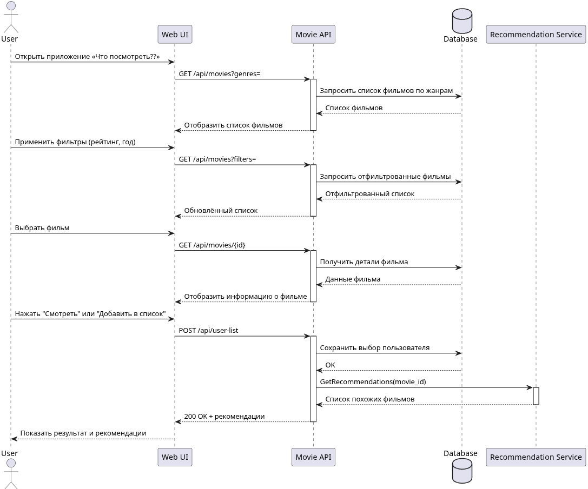
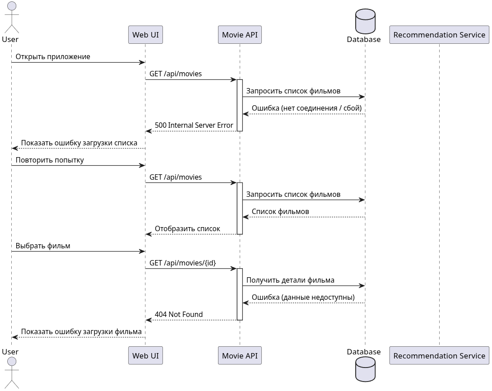

<p align="center">Министерство образования Республики Беларусь</p>
<p align="center">Учреждение образования</p>
<p align="center">"Брестский Государственный технический университет"</p>
<p align="center">Кафедра ИИТ</p>
<br><br><br><br><br><br>
<p align="center"><strong>Лабораторная работа №1</strong></p>
<p align="center"><strong>По дисциплине:</strong> "Проектирование интернет-систем"</p>
<p align="center"><strong>Тема:</strong> "Сценарий транзакции: моделирование use-case и границ ответственности"</p>
<br><br><br><br><br><br>
<p align="right"><strong>Выполнил:</strong></p>
<p align="right">Студент 3 курса</p>
<p align="right">Группы ПО-13</p>
<p align="right">Заяц Н.Д.</p>
<p align="right"><strong>Проверил:</strong></p>
<p align="right">Шорох Д.В.</p>
<br><br><br><br><br>
<p align="center"><strong>Брест 2026</strong></p>

---

## Цель работы

Научиться анализировать бизнес-процессы интернет-системы, выявлять границы ответственности компонентов и моделировать транзакционные сценарии с учётом возможных сбоев.

---

## Вариант №29 - Кино/сериалы «Что посмотреть?» 🎬

**Питч:** Советует лучше друга.

**Ядро домена:** Списки, Статусы, Рейтинги, Отзывы

---

## Ход выполнения работы

### 1. Структура проекта

```
lab-01/
├── README.md               # Основной отчёт (этот документ)
├── use-case.md             # Текстовое описание use-case
├── diagrams/
│   ├── sequence-happy.puml # PlantUML для успешного сценария
│   ├── sequence-happy.png  # Экспорт диаграммы
│   ├── sequence-error-payment.puml
│   └── sequence-error-payment.png
├── scenarios.feature       # Gherkin-сценарии
└── analysis.md             # Анализ границ ответственности
```

---

### 2. Use-case описание

👉 **Ссылка на файл:** [use-case.md](use-case.md)

**Основной сценарий:** Поиск фильмов

**Первичный актор:**  Пользователь 

**Цель:** Найти интересующий фильм для просмотра

**Краткое описание основного потока:**
1. Пользователь открывает приложение «Что посмотреть??».
2. Выбирает жанры и категории фильмов.
3. Выбирает понравившийся фильм.  
4. Просматривает подробную информацию о фильме (описание, актёры, рейтинг, трейлер).
5. Нажимает кнопку «Смотреть» или «Добавить в список».  
6. Система сохраняет выбор пользователя или перенаправляет на платформу для просмотра.
7. Пользователь получает рекомендацию похожих фильмов (опционально).

**Альтернативные потоки:** 
   - Пользователь ищет фильм по названию через строку поиска.
   - Пользователь сортирует фильмы по рейтингу, популярности или дате выхода.
   - Пользователь просматривает рекомендации на основе ранее просмотренных фильмов.
   - Пользователь добавляет фильм в «Избранное» или «Список на потом».

**Исключительные ситуации:** 
   - По выбранным фильтрам не найдено ни одного фильма.
   - Произошла ошибка при загрузке списка фильмов (например, отсутствует интернет или сбой сервера).
 
---

#### 3.1. Happy Path (успешный сценарий)

👉 **PlantUML исходник:** [sequence-happy.puml](diagrams/sequence-happy.puml)



**Описание потока:**
- Пользователь видит список фильмов в веб-интерфейсе.
- Пользователь выбирает интересующий фильм.
- Загружается подробная информация о фильме.
- Пользователь добавляет фильм в список или переходит к просмотру.
- Система сохраняет выбор пользователя.
- Система формирует и отображает рекомендации.
- Пользователю показывается результат (выбранный фильм и рекомендации).

**Участники:**
- Авторизованный пользователь
- UI
- API
- DataBase
- RecommendationService

#### 3.2. Error Case (сценарий с ошибкой)

👉 **PlantUML исходник:** [sequence-error-payment.puml](diagrams/sequence-error-payment.puml)



**Описание потока:**
- Если не удаётся загрузить список фильмов, пользователю отображается сообщение об ошибке.
- Пользователь может повторить попытку.
- Если не удаётся загрузить информацию о выбранном фильме, система уведомляет пользователя об ошибке.
- Пользователь может вернуться к списку фильмов или выбрать другой фильм.
- Если не удаётся сохранить выбор пользователя, система сообщает об ошибке и предлагает повторить действие.

---

### 4. Gherkin-сценарии

👉 **Ссылка на файл:** [scenarios.feature](scenarios.feature)

**Реализовано сценариев:** 5

**Список сценариев:**
1. ✅ Успешный сценарий (Happy Path)
2. ✅ Ошибка: Фильмы не найдены
3. ✅ Ошибка: Пользователь не авторизован
4. ✅ Ошибка: Сервис фильмов недоступен
5. ✅ Ошибка: Не удалось загрузить информацию о фильме

**Пример сценария:**
```gherkin
Feature: Поиск фильмов

  Scenario: Успешный поиск и выбор фильма (happy path)
    Given пользователь авторизован как "ivan@example.com"
    And в системе есть фильмы жанра "Комедия"
    When пользователь выбирает жанр "Комедия"
    And открывает фильм "Superbad"
    Then система отображает информацию о фильме "Superbad"
    And пользователь может добавить фильм в "Избранное"
    And пользователь видит рекомендации похожих фильмов
```

---

### 5. Анализ границ ответственности

👉 **Ссылка на файл:** [analysis.md](analysis.md)

#### 5.1. Транзакционные границы

| Операция | Синхронная/Асинхронная | Откат при ошибке | Retry-стратегия | Идемпотентность |
|----------|------------------------|------------------|-----------------|-----------------|
| Создание брони в БД | Синхронная | Да (ROLLBACK транзакции) | Нет (контролируется БД) | Да (проверка дублей по user_id+слот) |
| Проверка доступности слота| Синхронная | Да (в той же транзакции) | Нет | Да (повторная проверка по slot_id) | 
| Вызов Payment Service | Синхронная | Да (отмена брони) | 3 попытки с экспоненциальной задержкой | Да (payment_intent_id) |
 | Отправка email | Асинхронная | Нет (best-effort) | 5 попыток с экспоненциальным backoff | Да (дедупликация по booking_id) | 
 | Уведомление друзей/участников | Асинхронная | Нет (best-effort) | Повторная отправка через очередь | Да (по booking_id+user_id) |

#### 5.2. Обработка исключительных ситуаций

**Реализовано стратегий обработки:** 3

**Примеры:**

##### Исключительная ситуация 1: Таймаут сервиса фильмов

- **Условие возникновения:** Сервис фильмов не отвечает более 10 секунд при запросе списка или деталей фильма
- **Обнаружение:** HTTP‑клиент выбрасывает TimeoutException; логируется событие "MovieService timeout for user_id=12345"
- **Реакция:** Система возвращает пользователю сообщение об ошибке и предлагает повторить попытку
- **Компенсация:** Не требуется (операция не завершена)
- **Уведомление пользователя:** "Сервис временно недоступен. Попробуйте позже."

##### Исключительная ситуация 2: Фильмы по выбранным фильтрам не найдены

- **Условие возникновения:** По выбранным жанрам и фильтрам база данных или API возвращает пустой список
- **Обнаружение:** Проверка ответа API или запроса к БД — пустой массив
- **Реакция:** Система предлагает изменить фильтры или выбрать другой жанр
- **Компенсация:** Не требуется
- **Уведомление пользователя:** "Фильмы не найдены. Попробуйте изменить фильтры."

##### Исключительная ситуация 3: Таймаут сервиса уведомлений (Email)

- **Условие возникновения:** Email‑сервис не отвечает в течение 10 секунд при отправке подтверждения
- **Обнаружение:** API получает TimeoutException; логируется событие "NotificationService timeout for booking_id=12345"
- **Реакция:** Бронь остаётся подтверждённой; уведомление ставится в очередь для повторной отправки
- **Компенсация:** Не требуется (бронь действительна)
- **Уведомление пользователя:** "Бронь создана! Уведомление будет отправлено позже."

---

## Таблица критериев оценки

| Критерий | Баллы | Выполнено |
|----------|-------|-----------|
| Use-case описание (полнота: акторы, предусловия, основной поток, альтернативы, исключения) | 15 | ✅ |
| Sequence diagram (happy path) - корректность нотации UML, включение всех ключевых компонентов | 20 |  ✅ |
| Sequence diagram (error case) - моделирование хотя бы одной исключительной ситуации | 15 |  ✅ |
| Gherkin-сценарии - минимум 4 сценария (1 успешный + 3 ошибочных) | 20 | ✅ |
| Анализ границ ответственности - таблица транзакционных границ, обоснование выбора синхронных/асинхронных операций | 15 |  ✅ |
| Обработка исключений - описание стратегий retry, компенсации, уведомлений | 10 |  ✅ |
| Качество документации - оформление, читаемость, грамотность | 5 |  ✅ |
| **ИТОГО** | **100** | |

---

## Контрольные вопросы

**Подготовка к защите:**

1. Что такое транзакционная граница? Где она проходит в вашем сценарии?
   - Транзакционная граница — это участок процесса, где операции выполняются атомарно и согласованно. 
   - В нашем сценарии она начинается при нажатии пользователем кнопки «Забронировать» и заканчивается фиксацией брони в базе данных и подтверждением оплаты.

2. Почему операция X выбрана синхронной, а Y - асинхронной?
   - Синхронные операции (создание брони, проверка слота, вызов платёжного сервиса) критичны для целостности данных и требуют немедленного результата. 
   - Асинхронные операции (отправка email, уведомления) не влияют на факт брони и могут выполняться позже без нарушения логики.

3. Как обеспечить идемпотентность при повторных запросах?
   - Использовать уникальные идентификаторы операций (idempotency key). 
   - Проверять статус уже выполненной операции перед созданием новой. 
   - При повторном запросе возвращать результат существующей операции вместо дублирования.

4. Что произойдёт, если внешний сервис вернёт ошибку после частичного выполнения операции?
   - Система переводит процесс в промежуточный статус. 
   - Запускается механизм компенсации: откат изменений или отмена операции. 
   - Пользователь получает уведомление о задержке или сбое.

5. Как система обнаружит, что внешний сервис недоступен?
   - По таймауту сетевого запроса или по коду ошибки (например, 503 Service Unavailable). 
   - Событие фиксируется в логах. 
   - Запускается стратегия повторных попыток или постановка задачи в очередь.

6. Какие данные нужно логировать для диагностики сбоев?
   - Уникальный идентификатор операции.  
   - Пользовательский контекст (например, ID пользователя).  
   - Тип операции и её параметры.  
   - Время и причина ошибки (timeout, отказ сервиса).  
   - Количество попыток повторного выполнения и их результат.  
   - Текущий статус операции.

---

## Ссылка на репозиторий

👉 **GitHub:** [репозиторий](https://github.com/Ncrite1/PIS-2026)

---

## Вывод

> В ходе выполнения лабораторной работы был проанализирован бизнес-процесс Кино/сериалы «Что посмотреть?» 🎬. Разработаны use-case диаграммы для основного сценария и альтернативных потоков. Построены sequence diagrams с использованием PlantUML для визуализации взаимодействия компонентов системы. Созданы Gherkin-сценарии для автоматизированного тестирования. Определены транзакционные границы и стратегии обработки ошибок. Освоены навыки моделирования распределённых транзакций и анализа точек отказа в интернет-системах.

---

**Дата выполнения:** 06.03.2026

**Оценка:** _____________

**Подпись преподавателя:** _____________