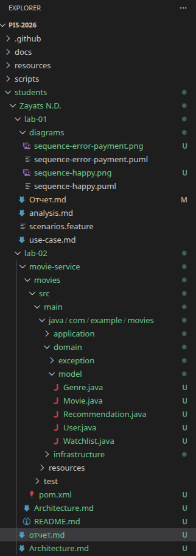

<p align="center">Министерство образования Республики Беларусь</p>
<p align="center">Учреждение образования</p>
<p align="center">"Брестский Государственный технический университет"</p>
<p align="center">Кафедра ИИТ</p>
<br><br><br><br><br><br>
<p align="center"><strong>Лабораторная работа №1</strong></p>
<p align="center"><strong>По дисциплине:</strong> "Проектирование интернет-систем"</p>
<p align="center"><strong>Тема:</strong> "Сценарий транзакции: моделирование use-case и границ ответственности"</p>
<br><br><br><br><br><br>
<p align="right"><strong>Выполнил:</strong></p>
<p align="right">Студент 3 курса</p>
<p align="right">Группы ПО-13</p>
<p align="right">Заяц Н.Д.</p>
<p align="right"><strong>Проверил:</strong></p>
<p align="right">Шорох Д.В.</p>
<br><br><br><br><br>
<p align="center"><strong>Брест 2026</strong></p>

---

## Цель работы

Спроектировать архитектуру основного сервиса системы с использованием гексагональной (hexagonal) архитектуры: создать структуру проекта, определить порты (интерфейсы) и продемонстрировать изоляцию слоёв через минимальные примеры.

---

## Вариант №29 - Кино/сериалы «Что посмотреть?» 🎬

**Питч:** Советует лучше друга.

**Ядро домена:** Списки, Статусы, Рейтинги, Отзывы

---

## Ход выполнения работы

### Часть 1. Архитектурная диаграмма

Описание сервиса: Movie Service управляет процессом поиска и выбора фильмов: получение списка фильмов, фильтрация по жанрам и параметрам, просмотр информации о фильмах и формирование рекомендаций.
Основные сущности: Movie (Фильм), Genre (Жанр), User (Пользователь), Watchlist (Список просмотра), Recommendation (Рекомендация).

**Диаграмма слоёв:**
```
┌──────────────────────────────────────────────────────────────┐
│                     Infrastructure Layer                     │
│  ┌──────────────────┐   ┌──────────────────────────────────┐ │
│  │ REST API         │   │ MovieRepository (DB / External)  │ │
│  │ Controllers      │   │ UserRepository                   │ │
│  └───────────┬──────┘   │ WatchlistRepository              │ │
│              │          │ RecommendationClient (API)       │ │
│              │          └──────────────────────────────────┘ │
└──────────────┼───────────────────────────────────────────────┘
               │
               ▼
┌──────────────────────────────────────────────────────────────┐
│                     Application Layer                        │
│  ┌──────────────────┐   ┌──────────────────────────────────┐ │
│  │ In Ports         │   │ Out Ports                        │ │
│  │ (Use Cases)      │   │ (Repositories, External APIs)    │ │
│  └───────────┬──────┘   └──────────────────────────────────┘ │
│              │                                               │
│  ┌───────────▼────────────────────────────────────────────┐  │
│  │   MovieService (поиск и фильтрация фильмов)            │  │
│  │   UserService (управление пользователями)              │  │
│  │   WatchlistService (избранное/список просмотра)        │  │
│  │   RecommendationService (рекомендации)                 │  │
│  └────────────────────────────────────────────────────────┘  │
└───────────────────────────┬──────────────────────────────────┘
                            │
                            ▼
┌──────────────────────────────────────────────────────────────┐
│                         Domain Layer                         │
│  ┌──────────────┐  ┌──────────────┐  ┌──────────────┐        │
│  │ Movie        │  │ Genre        │  │ User         │        │
│  │ (Aggregate)  │  │ (Entity)     │  │ (Aggregate)  │        │
│  └──────────────┘  └──────────────┘  └──────────────┘        │
│  ┌──────────────┐  ┌──────────────┐                          │
│  │ Watchlist    │  │ Recommendation│                         │
│  │ (Aggregate)  │  │ (Entity/VO)   │                         │
│  └──────────────┘  └──────────────┘                          │
└──────────────────────────────────────────────────────────────┘

```

---

### Часть 2. Структура проекта (скелет)

**Технология:** Java

**Структура папок:**

```

movie-service/
├── movies/src/
│   ├── main/
│   │   ├── java/
│   │   │   └── com/example/movies/
│   │   │       ├── domain/                           # Domain Layer
│   │   │       │   ├── model/                        # Доменные сущности
│   │   │       │   │   ├── Movie.java                # class Movie {}
│   │   │       │   │   ├── Genre.java                # class Genre {}
│   │   │       │   │   ├── User.java                 # class User {}
│   │   │       │   │   ├── Watchlist.java            # class Watchlist {}
│   │   │       │   │   └── Recommendation.java       # class Recommendation {}
│   │   │       │   └── exception/
│   │   │       │       └── DomainException.java      # class DomainException extends RuntimeException {}
│   │   │
│   │   │       ├── application/                      # Application Layer
│   │   │       │   ├── port/
│   │   │       │   │   ├── in/                       # Входящие порты (use-cases)
│   │   │       │   │   │   ├── SearchMoviesUseCase.java
│   │   │       │   │   │   ├── GetMovieDetailsUseCase.java
│   │   │       │   │   │   ├── AddToWatchlistUseCase.java
│   │   │       │   │   │   └── GetRecommendationsUseCase.java
│   │   │       │   │   └── out/                      # Исходящие порты (зависимости)
│   │   │       │   │       ├── MovieRepository.java
│   │   │       │   │       ├── UserRepository.java
│   │   │       │   │       ├── WatchlistRepository.java
│   │   │       │   │       └── RecommendationClient.java
│   │   │       │   └── service/                      # Реализация use-cases
│   │   │       │       ├── MovieService.java         # TODO: implement
│   │   │       │       ├── UserService.java          # TODO: implement
│   │   │       │       ├── WatchlistService.java     # TODO: implement
│   │   │       │       └── RecommendationService.java# TODO: implement
│   │   │
│   │   │       └── infrastructure/                   # Infrastructure Layer
│   │   │           ├── adapter/
│   │   │           │   ├── in/                       # Входящие адаптеры (REST)
│   │   │           │   │   ├── MovieController.java
│   │   │           │   │   ├── UserController.java
│   │   │           │   │   ├── WatchlistController.java
│   │   │           │   │   └── RecommendationController.java
│   │   │           │   └── out/                      # Исходящие адаптеры (репозитории / API)
│   │   │           │       ├── InMemoryMovieRepository.java
│   │   │           │       ├── InMemoryUserRepository.java
│   │   │           │       ├── InMemoryWatchlistRepository.java
│   │   │           │       └── ExternalRecommendationClient.java
│   │   │           └── config/
│   │   │               └── DependencyInjectionConfig.java   # Скелет DI
│   │   │
│   │   └── resources/...
│   │
│   └── test/...
│       └── ...
│   │___pom.xml
│
├── README.md
└── Architecture.md

```

**Скриншот структуры в IDE**:



---

### Часть 3. Domain Layer (Доменный слой)

#### Доменные сущности

**Entity 1**: Movie (Фильм)

```java

package com.example.movies.domain.model;

public class Movie {
    private final Long id;
    private final String title;
    private final String genre;
    private final int releaseYear;
    private final double rating;
    private final String description;

    public Movie(Long id, String title, String genre, int releaseYear, double rating, String description) {
        this.id = id;
        this.title = title;
        this.genre = genre;
        this.releaseYear = releaseYear;
        this.rating = rating;
        this.description = description;
    }

    public Long getId() { return id; }
    public String getTitle() { return title; }
    public String getGenre() { return genre; }
    public int getReleaseYear() { return releaseYear; }
    public double getRating() { return rating; }
    public String getDescription() { return description; }
}

```

**Value Object 1**: Genre

```java
package com.example.movies.domain.model;

public record Genre(String name) {}
```

**Доменные исключения**:
- DomainException

#### Бизнес-правила

Перечислите основные бизнес-правила, реализованные в domain слое:

1. Нельзя создать бронь, если площадка недоступна в выбранный интервал.
2. Время начала брони должно быть раньше времени окончания.
3. Нельзя забронировать площадку задним числом.
4. Отзыв можно оставить только после завершения брони.

---

### Часть 4. Application Layer (Прикладной слой)

#### Входящие порты (Inbound Ports)

Интерфейсы, которые предоставляет система внешнему миру:

**SearchMoviesUseCase**:
```java
package com.example.movies.application.port.in;

import java.util.List;
import com.example.movies.domain.model.Movie;

public interface SearchMoviesUseCase {
    List<Movie> search(SearchMoviesCommand command);
}
```

**GetRecommendationsUseCase**:
```java
package com.example.movies.application.port.in;

import java.util.List;
import com.example.movies.domain.model.Recommendation;

public interface GetRecommendationsUseCase {
    List<Recommendation> getForUser(Long userId);
}
```

**GetMovieDetailsUseCase**:
```java
package com.example.movies.application.port.in;

import com.example.movies.domain.model.Movie;

public interface GetMovieDetailsUseCase {
    Movie getById(Long movieId);
}
```

**AddToWatchlistUseCase**:
```java
package com.example.movies.application.port.in;

public interface AddToWatchlistUseCase {
    void add(AddToWatchlistCommand command);
}
```

#### Исходящие порты (Outbound Ports)

Интерфейсы, через которые система взаимодействует с внешним миром:

**MovieRepository**:
```java
package com.example.movies.application.port.out;

import java.util.List;
import java.util.Optional;
import com.example.movies.domain.model.Movie;

public interface MovieRepository {
    List<Movie> findAll();
    List<Movie> findByFilters(String genre, Integer releaseYear, Double minRating);
    Optional<Movie> findById(Long id);
}
```

**RecommendationClient**:
```java
package com.example.movies.application.port.out;

import java.util.List;
import com.example.movies.domain.model.Recommendation;

public interface RecommendationClient {
    List<Recommendation> getRecommendations(Long userId);
}
```

**UserRepository**:
```java
package com.example.movies.application.port.out;

import java.util.Optional;
import com.example.movies.domain.model.User;

public interface UserRepository {
    Optional<User> findById(Long id);
    Optional<User> findByEmail(String email);
}
```

**WatchlistRepository**:
```java
package com.example.movies.application.port.out;

import com.example.movies.domain.model.Watchlist;

public interface WatchlistRepository {
    Watchlist findByUserId(Long userId);
    void save(Watchlist watchlist);
    boolean existsByUserIdAndMovieId(Long userId, Long movieId);
}
```

#### Application Service

**MovieService**:
```java
package com.example.movies.application.service;

import com.example.movies.application.port.in.SearchMoviesUseCase;
import com.example.movies.application.port.in.GetMovieDetailsUseCase;

public class MovieService implements SearchMoviesUseCase, GetMovieDetailsUseCase {
    @Override
    public Object search(Object command) {
        return null;
    }

    @Override
    public Object getById(Long movieId) {
        return null;
    }
}
```

**Основная логика**:
  Находит фильмы по жанру, году и рейтингу


**RecommendationService**:
```java
package com.example.movies.application.service;

import com.example.movies.application.port.in.GetRecommendationsUseCase;

public class RecommendationService implements GetRecommendationsUseCase {
    @Override
    public Object getForUser(Long userId) {
        return null;
    }
}
```

**Основная логика**:
  Подбирает фильмы, которые могут вам понравиться

**UserService**:
```java
package com.example.movies.application.service;

import com.example.movies.application.port.in.GetMovieDetailsUseCase; 
import com.example.movies.application.port.in.SomeUserUseCase;      

public class UserService implements SomeUserUseCase { 
    @Override
    public Object someUserMethod(Object command) {
        return null;
    }
}
```

**Основная логика**:
  Работает с данными пользователя (регистрация, профиль)    

**WatchlistRepository**:
```java
package com.example.movies.application.service;

import com.example.movies.application.port.in.AddToWatchlistUseCase;

public class WatchlistService implements AddToWatchlistUseCase {
    @Override
    public void add(Object command) {
    }
}
```

**Основная логика**:
  Добавляет фильм в ваш список избранного

### Часть 5. Infrastructure Layer (Инфраструктурный слой)

#### Входящий адаптер: REST API

**MovieController**:
```java
@RestController
@RequestMapping("/api/movies")
public class MovieController {

    private final SearchMoviesUseCase searchMoviesUseCase;
    private final GetMovieDetailsUseCase getMovieDetailsUseCase;

    public MovieController(SearchMoviesUseCase searchMoviesUseCase,
                           GetMovieDetailsUseCase getMovieDetailsUseCase) {
        this.searchMoviesUseCase = searchMoviesUseCase;
        this.getMovieDetailsUseCase = getMovieDetailsUseCase;
    }

    @GetMapping("/search")
    public List<Movie> search(SearchMoviesRequest request) {
        return searchMoviesUseCase.search(request.toCommand());
    }

    @GetMapping("/{id}")
    public Movie getById(@PathVariable Long id) {
        return getMovieDetailsUseCase.getById(id);
    }
}
```

**Эндпоинты**:
- `GET /api/movies/search` - поиск фильмов
- `GET /api/movies/{id}` - детали фильма

**Пример запроса/ответа**:

```json
GET /api/movies/search?genre=Comedy&minRating=7

Ответ:
[
  {"id":1, "title":"Comedy Movie", "genre":"Comedy", "releaseYear":2022, "rating":8.2, "description":"..."}
]
```

#### Исходящий адаптер: Repository

**InMemoryMovieRepository**:
```java
public class InMemoryMovieRepository implements MovieRepository {

    private final Map<Long, Movie> storage = new HashMap<>();

    @Override
    public List<Movie> findAll() {
        return new ArrayList<>(storage.values());
    }

    @Override
    public List<Movie> findByFilters(String genre, Integer releaseYear, Double minRating) {
        return storage.values().stream()
                .filter(m -> (genre == null || m.getGenre().equalsIgnoreCase(genre)) &&
                             (releaseYear == null || m.getReleaseYear().equals(releaseYear)) &&
                             (minRating == null || m.getRating() >= minRating))
                .toList();
    }

    @Override
    public Optional<Movie> findById(Long id) {
        return Optional.ofNullable(storage.get(id));
    }

    @Override
    public Movie save(Movie movie) {
        storage.put(movie.getId(), movie);
        return movie;
    }
}
```

**Принцип работы**:
Данные хранятся оперативной памяти

---

### Часть 6. Dependency Injection (Конфигурация зависимостей)

**DependencyInjectionConfig** :

```java
@Configuration
public class DependencyInjectionConfig {

    @Bean MovieRepository movieRepo() { return new InMemoryMovieRepository(); }
    @Bean UserRepository userRepo() { return new InMemoryUserRepository(); }
    @Bean WatchlistRepository watchlistRepo() { return new InMemoryWatchlistRepository(); }
    @Bean RecommendationClient recClient() { return new ExternalRecommendationClient(); }

    @Bean SearchMoviesUseCase searchMovies(MovieRepository repo) { return new MovieService(repo); }
    @Bean GetMovieDetailsUseCase movieDetails(MovieRepository repo) { return new MovieService(repo); }
    @Bean AddToWatchlistUseCase addWatchlist(WatchlistRepository wRepo, MovieRepository mRepo) { return new WatchlistService(wRepo, mRepo); }
    @Bean GetRecommendationsUseCase getRecs(RecommendationClient client) { return new RecommendationService(client); }
    @Bean UserService userService(UserRepository repo) { return new UserService(repo); }

    @Bean MovieController movieController(SearchMoviesUseCase search, GetMovieDetailsUseCase details) { return new MovieController(search, details); }
    @Bean WatchlistController watchlistController(AddToWatchlistUseCase add) { return new WatchlistController(add); }
    @Bean RecommendationController recController(GetRecommendationsUseCase rec) { return new RecommendationController(rec); }
    @Bean UserController userController(UserService userService) { return new UserController(userService); }
}
```

**Как работает DI**:
Создаются бины контроллеров и в них внедряются реализации портов

---

### Часть 7. Тестирование

#### Юнит-тесты для  BookingService

```java
class MovieServiceTest {

    @Test
    void testSearchAndGet() {
        MovieRepository repo = mock(MovieRepository.class);
        Movie movie = new Movie(1L, "Action", "Action", 2021, 7.5, "Exciting");
        when(repo.findByFilters("Action", 2021, 7.0)).thenReturn(List.of(movie));
        when(repo.findById(1L)).thenReturn(Optional.of(movie));
        when(repo.findById(999L)).thenReturn(Optional.empty());

        MovieService service = new MovieService(repo);

        assertEquals(1, service.search("Action", 2021, 7.0).size());
        assertEquals("Action", service.getById(1L).getTitle());
        assertThrows(RuntimeException.class, () -> service.getById(999L));
    }
}
```

**Что тестируется**:
- ✅ Поиск фильмов
- ✅ Получение фильма по ID

**Mock-объекты**:
  MovieRepository

## 3. Архитектурная диаграмма

### Диаграмма слоёв

```
┌──────────────────────────────────────────────────────────────┐
│                     Infrastructure Layer                     │
│  ┌──────────────────┐   ┌──────────────────────────────────┐ │
│  │ REST API         │   │ MovieRepository (DB / InMemory)  │ │
│  │ Controllers      │   │ UserRepository                   │ │
│  └───────────┬──────┘   │ WatchlistRepository              │ │
│              │          │ RecommendationClient             │ │
│              │          └──────────────────────────────────┘ │
└──────────────┼───────────────────────────────────────────────┘
               │
               ▼
┌──────────────────────────────────────────────────────────────┐
│                     Application Layer                        │
│  ┌──────────────────┐   ┌──────────────────────────────────┐ │
│  │ In Ports         │   │ Out Ports                        │ │
│  │ (Use Cases)      │   │ (Repositories, External Client)  │ │
│  └───────────┬──────┘   └──────────────────────────────────┘ │
│              │                                               │
│  ┌───────────▼────────────────────────────────────────────┐  │
│  │ MovieService (поиск и детали фильмов)                  │  │
│  │ WatchlistService (управление избранным)                │  │
│  │ UserService (управление пользователями)                │  │
│  │ RecommendationService (рекомендации фильмов)           │  │
│  └────────────────────────────────────────────────────────┘  │
└───────────────────────────┬──────────────────────────────────┘
                            │
                            ▼
┌──────────────────────────────────────────────────────────────┐
│                         Domain Layer                         │
│  ┌──────────────┐  ┌──────────────┐  ┌──────────────┐        │
│  │ Movie        │  │ User         │  │ Watchlist    │        │
│  │ (Aggregate)  │  │ (Aggregate)  │  │ (Entity)     │        │
│  └──────────────┘  └──────────────┘  └──────────────┘        │
│  ┌──────────────┐                                            │
│  │ Recommendation│                                           │
│  │ (Value Object)│                                           │
│  └──────────────┘                                            │
└──────────────────────────────────────────────────────────────┘

```

### Описание портов и адаптеров

| Тип                   | Название                        | Назначение                                                |
| --------------------- | ------------------------------- | --------------------------------------------------------- |
| **Входящий порт**     | ICreateMovieUseCase             | *Интерфейс для добавления фильма в систему*               |
| **Входящий порт**     | ISearchMoviesUseCase            | *Интерфейс для поиска фильмов по жанру, году, рейтингу*   |
| **Входящий порт**     | IGetMovieDetailsUseCase         | *Интерфейс для получения подробной информации о фильме*   |
| **Входящий порт**     | IManageWatchlistUseCase         | *Интерфейс для работы со списком избранного пользователя* |
| **Входящий порт**     | IGetUserUseCase                 | *Интерфейс для получения информации о пользователе*       |
| **Входящий порт**     | IGetRecommendationsUseCase      | *Интерфейс для получения рекомендованных фильмов*         |
| **Исходящий порт**    | IMovieRepository                | *Интерфейс для доступа к данным фильмов*                  |
| **Исходящий порт**    | IUserRepository                 | *Интерфейс для доступа к данным пользователей*            |
| **Исходящий порт**    | IWatchlistRepository            | *Интерфейс для хранения списка избранного*                |
| **Исходящий порт**    | IRecommendationClient           | *Интерфейс для получения внешних рекомендаций*            |
| **Входящий адаптер**  | MovieController (REST)          | *REST API для поиска фильмов и просмотра деталей*         |
| **Входящий адаптер**  | UserController (REST)           | *REST API для управления пользователями*                  |
| **Входящий адаптер**  | WatchlistController (REST)      | *REST API для работы со списком избранного*               |
| **Входящий адаптер**  | RecommendationController (REST) | *REST API для получения рекомендаций фильмов*             |
| **Исходящий адаптер** | InMemoryMovieRepository         | *Реализация хранилища фильмов в памяти*                   |
| **Исходящий адаптер** | InMemoryUserRepository          | *Реализация хранилища пользователей в памяти*             |
| **Исходящий адаптер** | InMemoryWatchlistRepository     | *Реализация хранения избранного в памяти*                 |
| **Исходящий адаптер** | ExternalRecommendationClient    | *Реализация внешнего клиента рекомендаций фильмов*        |

---

## 4. Критерии выполнения

| Критерий | Выполнено | Комментарий |
|----------|-----------|-------------|
| Структура проекта (domain/application/infrastructure) | ✅ | 
| Domain Layer (чистая бизнес-логика) |  ✅ | 
| Порты (входящие и исходящие интерфейсы) | ✅ |
| Адаптеры (минимум 1 входящий + 2 исходящих) | ✅ | 
| DI-конфигурация (зависимости инжектятся) |  ✅ | 
| Юнит-тесты для BookingService с моками |  ✅ | 
| Документация (диаграмма, описание) | ✅ | 

**Итого**: 7 / 7

## 6. Выводы

### Что получилось хорошо

Удалось чётко разделить доменный слой (Movie, Recommendation, Watchlist) и инфраструктуру. Domain‑модели не содержат зависимостей от Spring или БД.Application‑сервисы (MovieService, WatchlistService) легко тестируются с моками, так как работают только через порты.Структура проекта получилась чистой и соответствует Hexagonal Architecture.

### С какими трудностями столкнулись

Первоначально было сложно понять, зачем создавать отдельные интерфейсы для портов, если есть только одна реализация.Также возникли сложности с тем, как правильно разделить ответственность между сервисами и доменными моделями.Настройка DI в Spring потребовала понимания того, как бины связываются через интерфейсы.

### Что узнали нового

Узнал, как работает Hexagonal Architecture и почему важно отделять бизнес‑логику от инфраструктуры.
Разобрался в принципе Dependency Inversion: доменный слой не должен зависеть от деталей реализации.
Понял, как порты позволяют легко подменять адаптеры (например, InMemory → PostgreSQL).
Освоил базовые принципы DI в Spring и понял, как они помогают тестировать приложение.

### Как можно улучшить

Добавить реальную БД (PostgreSQL) вместо InMemory‑репозиториев.Реализовать полноценную проверку доступности площадок с учётом расписания. Добавить интеграционные тесты с TestContainers.
Реализовать проверку уникальности фильмов при добавлении и синхронизацию с внешними источниками.

---

### Ссылка на репозиторий

_[https://github.com/Ncrite1/PIS-2026]_

**Дата сдачи**: 19.03.2026 
**Подпись студента**: Заяц Н. Д.

