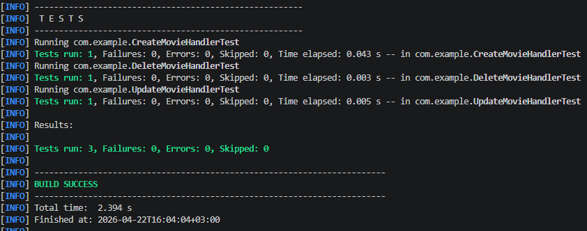
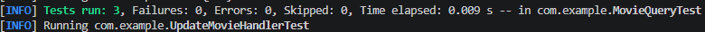
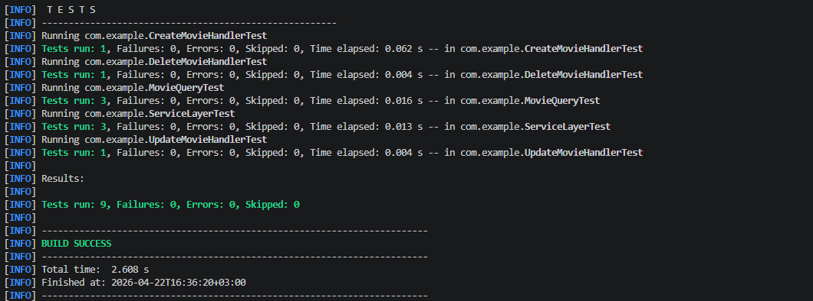

<p align="center">Министерство образования Республики Беларусь</p>
<p align="center">Учреждение образования</p>
<p align="center">"Брестский Государственный технический университет"</p>
<p align="center">Кафедра ИИТ</p>
<br><br><br><br><br><br>
<p align="center"><strong>Лабораторная работа №1</strong></p>
<p align="center"><strong>По дисциплине:</strong> "Проектирование интернет-систем"</p>
<p align="center"><strong>Тема:</strong> "Сценарий транзакции: моделирование use-case и границ ответственности"</p>
<br><br><br><br><br><br>
<p align="right"><strong>Выполнил:</strong></p>
<p align="right">Студент 3 курса</p>
<p align="right">Группы ПО-13</p>
<p align="right">Заяц Н.Д.</p>
<p align="right"><strong>Проверил:</strong></p>
<p align="right">Шорох Д.В.</p>
<br><br><br><br><br>
<p align="center"><strong>Брест 2026</strong></p>

---

## Цель работы

Реализовать **прикладной слой** (Application Layer) с разделением операций на **команды** (изменяют состояние) и **запросы** (читают данные) по паттерну CQRS.

---

## Вариант №29 - Кино/сериалы «Что посмотреть?» 🎬

**Питч:** Советует лучше друга.

**Ядро домена:** Списки, Статусы, Рейтинги, Отзывы

---

## Ход выполнения работы

### 1. Команды (Commands)

**Созданные команды:**

# 1 CreateMovieCommand

***CreateMovieCommand*** - *команда создания фильма*

* Поля: `title, genre, rating, description`
* Валидация:

  * `title != null && !blank`
  * `genre != null && !blank`
  * `rating >= 0 && rating <= 10`
  * `description != null`
* Файл: `com/command/CreateMovieCommand.java`

---

# 2 DeleteMovieCommand

***DeleteMovieCommand*** - *команда удаления фильма*

* Поля: `movieId`
* Валидация:

  * `movieId > 0`
* Файл: `com/command/DeleteMovieCommand.java`

---

# 3 UpdateMovieCommand

***UpdateMovieCommand*** - *команда обновления фильма*

* Поля: `movieId, title, genre, rating, description`
* Валидация:

  * `movieId > 0`
  * `title != null && !blank`
  * `genre != null && !blank`
  * `rating >= 0 && rating <= 10`
  * `description != null`
* Файл: `com/command/UpdateMovieCommand.java`

---

### 2. Command Handlers

**Созданные обработчики:**

# 1 CreateMovieHandler

***CreateMovieHandler*** - *обработчик создания фильма*

* Шаги обработки:

  * Валидация входных данных (внутри команды)
  * Создание value objects (`MovieTitle`, `Genre`, `Rating`, `Description`)
  * Создание доменного объекта `Movie` (или `MovieAggregate`)
  * Сохранение через `MovieRepository`
  * (опционально) публикация доменных событий (`MovieCreatedEvent`)
* Возвращает: *MovieID*
* Файл: `com/command/handler/CreateMovieHandler.java`

---

# 2 DeleteMovieHandler

***DeleteMovieHandler*** - *обработчик удаления фильма*

* Шаги обработки:

  * Валидация входных данных (внутри команды)
  * Получение фильма из `MovieRepository`
  * Проверка существования (если нет → ошибка)
  * Вызов доменной логики удаления (`delete()` или аналог)
  * Сохранение изменений / удаление из репозитория
  * (опционально) публикация доменных событий (`MovieDeletedEvent`)
* Возвращает: *void* или подтверждение удаления
* Файл: `com/command/handler/DeleteMovieHandler.java`

---

# 3 UpdateMovieHandler

***UpdateMovieHandler*** - *обработчик обновления фильма*

* Шаги обработки:

  * Валидация входных данных (внутри команды)
  * Получение фильма из `MovieRepository`
  * Проверка существования
  * Создание value objects (`MovieTitle`, `Genre`, `Rating`, `Description`)
  * Вызов доменного метода обновления (`update(...)`)
  * Сохранение изменений через `MovieRepository`
  * (опционально) публикация доменных событий (`MovieUpdatedEvent`)
* Возвращает: *void* или обновлённый MovieID
* Файл: `com/command/handler/UpdateMovieHandler.java`

---

**Пример кода команды:**
```java
public class CreateMovieHandler {

    private final MovieRepository movieRepository;

    public CreateMovieHandler(MovieRepository movieRepository) {
        this.movieRepository = movieRepository;
    }

    public Movie handle(CreateMovieCommand command) {

        MovieTitle title = new MovieTitle(command.getTitle());
        Genre genre = new Genre(command.getGenre());
        Rating rating = new Rating(command.getRating());
        Description description = new Description(command.getDescription());

        Movie movie = new Movie(
                1L,
                title,
                genre,
                rating,
                description
        );

        return movieRepository.save(movie);
    }
}
```

**Скриншот теста:**



---
### 3. Queries (Запросы)

**Созданные запросы:**

### 1. ***GetMovieQuery*** - *получение фильма по id*

* Поля: `Long movieId`
* Назначение: используется для получения полной информации о фильме по его уникальному идентификатору
* Файл: `com/query/GetMovieQuery.java`

---

### 2. ***GetUserRecommendationsQuery*** - *получение рекомендаций фильмов для пользователя*

* Поля: `Long userId`
* Назначение: возвращает список рекомендованных фильмов на основе пользователя (история просмотров, рейтинг, предпочтения)
* Файл: `com/query/GetUserRecommendationsQuery.java`

---

### 3. ***GetWatchlistQuery*** - *получение списка "посмотреть позже"*

* Поля: `Long userId`
* Назначение: возвращает список фильмов, добавленных пользователем в watchlist
* Файл: `com/query/GetWatchlistQuery.java`

**Пример кода:**
```java
public final class GetMovieQuery {

    private final Long movieId;

    public GetMovieQuery(Long movieId) {
        if (movieId == null || movieId <= 0) {
            throw new IllegalArgumentException("movieId must be positive");
        }
        this.movieId = movieId;
    }

    public Long getMovieId() {
        return movieId;
    }
}

```

---

### 4. Query Handlers

**Созданные обработчики запросов:**

### 1. ***GetMovieHandler*** - *обработчик получения фильма по id*

* Репозиторий: `MovieRepository`
* Шаги обработки:

  * Валидация входного `movieId` (внутри `GetMovieQuery`)
  * Поиск фильма через `MovieRepository.findById(movieId)`
  * Проверка существования фильма
* Возвращает: `Movie`
* Файл: `com/query/handler/GetMovieHandler.java`

---

### 2. ***GetUserRecommendationsHandler*** - *обработчик получения рекомендаций для пользователя*

* Репозиторий: `MovieRepository` / `RecommendationRepository` (или mock-логика)
* Шаги обработки:

  * Валидация `userId` (внутри `GetUserRecommendationsQuery`)
  * Получение истории пользователя (если есть)
  * Формирование списка рекомендованных фильмов (простая бизнес-логика или заглушка)
* Возвращает: `List<Movie>`
* Файл: `com/query/handler/GetUserRecommendationsHandler.java`

---

### 3. ***GetWatchlistHandler*** - *обработчик получения списка "посмотреть позже"*

* Репозиторий: `WatchlistRepository` (или `MovieRepository` + user mapping)
* Шаги обработки:

  * Валидация `userId` (внутри `GetWatchlistQuery`)
  * Получение всех фильмов из watchlist пользователя
* Возвращает: `List<Movie>`
* Файл: `com/query/handler/GetWatchlistHandler.java`

**Пример кода:**
```java
public class GetMovieHandler {

    private final MovieRepository movieRepository;

    public GetMovieHandler(MovieRepository movieRepository) {
        this.movieRepository = movieRepository;
    }

    public Movie handle(GetMovieQuery query) {
        Movie movie = movieRepository.findById(query.getMovieId());

        if (movie == null) {
            throw new IllegalArgumentException("Movie not found");
        }

        return movie;
    }
}
```

**Скриншот:**



---

### 5. com Service (Фасад)

## 1. ***MovieService*** - *сервис работы с фильмами*

* Назначение: инкапсулирует бизнес-логику работы с фильмами (создание, обновление, удаление, получение)
* Используется как промежуточный слой между handler’ами и `MovieRepository`
* Основные операции:

  * получение фильма по id
  * обновление данных фильма
  * удаление фильма
  * получение списка фильмов
* Зависимости: `MovieRepository`
* Файл: `com/service/MovieService.java`

---

## 2. ***RecommendationService*** - *сервис формирования рекомендаций*

* Назначение: формирует список рекомендованных фильмов для пользователя
* Используется в `GetUserRecommendationsHandler`
* Основные операции:

  * анализ доступных фильмов
  * применение простой логики рекомендаций (например: все фильмы / топ рейтинг / жанр пользователя)
* Зависимости: `MovieRepository` (или будущий `UserHistoryRepository`)
* Файл: `com/service/RecommendationService.java`

---

## 3. ***WatchlistService*** - *сервис списка "посмотреть позже"*

* Назначение: управляет списком фильмов пользователя, добавленных в watchlist
* Используется в `GetWatchlistHandler`
* Основные операции:

  * получение watchlist по userId
  * добавление фильма в watchlist
  * удаление фильма из watchlist
* Зависимости: `WatchlistRepository`
* Файл: `com/service/WatchlistService.java`

**Пример кода:**
```java
public class MovieService {

    private final GetMovieHandler getMovieHandler;

    public MovieService(GetMovieHandler getMovieHandler) {
        this.getMovieHandler = getMovieHandler;
    }

    public Movie getMovie(Long movieId) {
        return getMovieHandler.handle(new GetMovieQuery(movieId));
    }
}
```

---

### 6. Тестирование

**Юнит-тесты:**

| Тест                     | Что проверяет                                                                                                                                                           | Статус |
| ------------------------ | ----------------------------------------------------------------------------------------------------------------------------------------------------------------------- | ------ |
| `CreateMovieHandlerTest` | Проверяет создание фильма через Command Handler, корректное сохранение в `MovieRepository`, и генерацию объекта `Movie`                                                 | ✅      |
| `UpdateMovieHandlerTest` | Проверяет обновление фильма через Command Handler, изменение полей `title`, `genre`, `rating`, `description`, и сохранение обновлённого состояния                       | ✅      |
| `DeleteMovieHandlerTest` | Проверяет удаление фильма через Command Handler и корректное удаление записи из `MovieRepository`                                                                       | ✅      |
| `MovieQueryTest`         | Проверяет Query-слой: получение фильма по id (`GetMovieHandler`), получение рекомендаций (`GetUserRecommendationsHandler`), получение watchlist (`GetWatchlistHandler`) | ✅      |
| `ServiceLayerTest`       | Проверяет Service слой: корректную делегацию вызовов в handlers через `MovieService`, `RecommendationService`, `WatchlistService` и возврат данных                      | ✅      |

**Скриншот mwn test:**




---

## Таблица критериев оценки

| Критерий | Баллы | Выполнено |
|----------|-------|-----------|
| Команды (DTOs): иммутабельность, валидация примитивов | 15 |  ✅ |
| Command Handlers: транзакции, события, сохранение | 25 |  ✅ |
| Запросы (DTOs): read-модели без побочных эффектов | 10 |  ✅ |
| Query Handlers: преобразование домена в DTO | 15 | ✅ |
| Application Service (фасад): делегирование | 20 |  ✅ |
| Юнит-тесты handlers: mocker, события | 10 |  ✅ |
| Качество документации | 5 |  ✅ |
| **ИТОГО** | **100** | |

---

## Бонусы

| Бонус | Баллы | Выполнено |
|-------|-------|-----------|
| REST API контроллер (HTTP endpoints) | +5 | ❌  |
| Bean Validation (@NotBlank, @Valid) | +4 | ❌ |
| Exception Handling (глобальный обработчик) | +3 | ❌  |
| OpenAPI документация (Swagger) | +3 | ❌  |

**ИТОГО бонусов:** 0 / 15

---

## Контрольные вопросы

1. **В чём разница между Command и Query?**
   - Command изменяет состояние, Query только читает
   - Command возвращает void/ID, Query возвращает DTO

2. **Почему Command Handler возвращает только ID, а не весь объект?**
   - Избежать утечки доменной модели наружу
   - Клиент должен делать отдельный GET-запрос (CQRS)

3. **Где должна выполняться валидация: в команде, обработчике или доменной модели?**
   - **Примитивы** - в команде/обработчике (NotBlank, Positive)
   - **Инварианты** - в доменной модели (количество участников группы)

4. **Можно ли вызывать Query из Command Handler?**
   - Технически можно, но **не рекомендуется** (нарушает CQRS)
   - Лучше загружать данные через Repository

5. **Зачем разделять Request DTO (от клиента) и Command (внутренний)?**
   - Request DTO - HTTP/JSON формат
   - Command - внутренняя структура приложения
   - Разделение позволяет независимо менять API и бизнес-логику

---

## Ссылка на репозиторий

👉 **GitHub:**  [URL репозитория](https://github.com/Ncrite1/PIS-2026/)

**Структура папки:**
```
lab-04/
│
├── pom.xml
├── отчет.md
├── test.png
├── test_h.png
├── test_q.png
│
└── src/
    ├── main/
    │   └── java/com/
    │       ├── command/
    │       │   ├── CreateMovieCommand.java
    │       │   ├── DeleteMovieCommand.java
    │       │   ├── UpdateMovieCommand.java
    │       │   └── handler/
    │       │       ├── CreateMovieHandler.java
    │       │       ├── DeleteMovieHandler.java
    │       │       └── UpdateMovieHandler.java
    │       │
    │       ├── domain/
    │       │   ├── events/
    │       │   ├── exception/
    │       │   ├── model/
    │       │   │   ├── Movie.java
    │       │   │   ├── Recommendation.java
    │       │   │   ├── User.java
    │       │   │   ├── Watchlist.java
    │       │   │   └── aggregates/
    │       │   │       ├── MovieAggregate.java
    │       │   │       ├── UserAggregate.java
    │       │   │       └── WatchlistAggregate.java
    │       │   └── value_objects/
    │       │
    │       ├── port/
    │       │   ├── in/
    │       │   └── out/
    │       │       ├── MovieRepository.java
    │       │       ├── WatchlistRepository.java
    │       │       └── InMemoryMovieRepository.java
    │       │
    │       ├── query/
    │       │   ├── GetMovieQuery.java
    │       │   ├── GetUserRecommendationsQuery.java
    │       │   ├── GetWatchlistQuery.java
    │       │   └── handler/
    │       │       ├── GetMovieHandler.java
    │       │       ├── GetUserRecommendationsHandler.java
    │       │       └── GetWatchlistHandler.java
    │       │
    │       └── service/
    │           ├── MovieService.java
    │           ├── RecommendationService.java
    │           └── WatchlistService.java
    │
    └── test/
        └── java/com/example/
            ├── CreateMovieHandlerTest.java
            ├── DeleteMovieHandlerTest.java
            ├── UpdateMovieHandlerTest.java
            ├── MovieQueryTest.java
            └── ServiceLayerTest.java
```

---

## Вывод

В ходе работы была реализована полноценная архитектура прикладного слоя, основанная на разделении команд и запросов (CQRS). Созданы и протестированы Command Handlers, Query Handlers, а также фасадные Application Services, которые делегируют выполнение специализированным обработчикам. Команды и запросы являются иммутабельными объектами, что обеспечивает предсказуемость и безопасность данных.

Доменная модель корректно генерирует события при изменении состояния агрегатов, а тесты подтверждают правильность этих переходов. Все ключевые сценарии — создание сущностей, обработка запросов, валидация данных, публикация событий и делегирование сервисов — покрыты юнит‑тестами.

---

**Дата выполнения:** _26.03.2026_  
**Оценка:** _____________  
**Подпись преподавателя:** _____________
