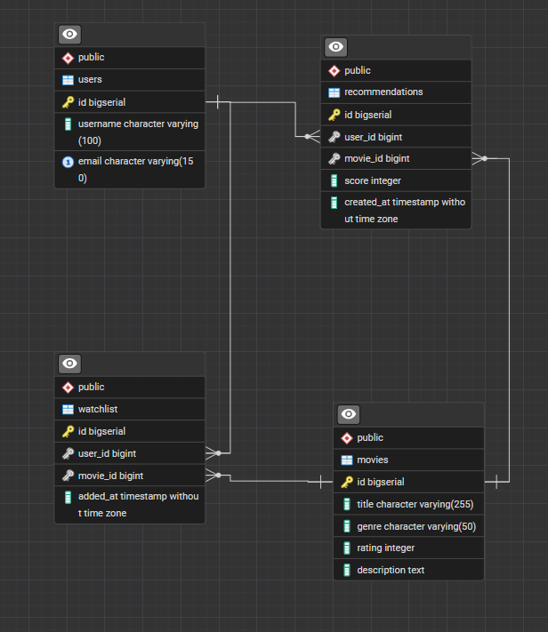
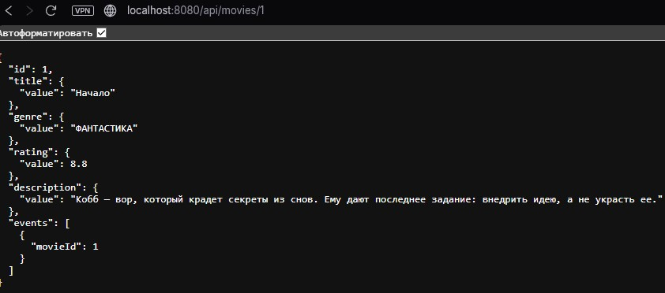
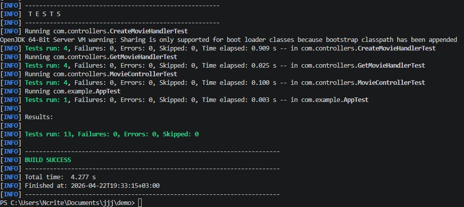

<p align="center">Министерство образования Республики Беларусь</p>
<p align="center">Учреждение образования</p>
<p align="center">"Брестский Государственный технический университет"</p>
<p align="center">Кафедра ИИТ</p>
<br><br><br><br><br><br>
<p align="center"><strong>Лабораторная работа №1</strong></p>
<p align="center"><strong>По дисциплине:</strong> "Проектирование интернет-систем"</p>
<p align="center"><strong>Тема:</strong> "Сценарий транзакции: моделирование use-case и границ ответственности"</p>
<br><br><br><br><br><br>
<p align="right"><strong>Выполнил:</strong></p>
<p align="right">Студент 3 курса</p>
<p align="right">Группы ПО-13</p>
<p align="right">Заяц Н.Д.</p>
<p align="right"><strong>Проверил:</strong></p>
<p align="right">Шорох Д.В.</p>
<br><br><br><br><br>
<p align="center"><strong>Брест 2026</strong></p>

---

## Цель работы

Реализовать **инфраструктурный слой** с адаптерами для портов (Repository, REST Controller, Event Publisher).

---

## Вариант №29 - Кино/сериалы «Что посмотреть?» 🎬

**Питч:** Советует лучше друга.

**Ядро домена:** Списки, Статусы, Рейтинги, Отзывы

---

## Ход выполнения работы

### 1. Repository (PostgreSQL)

| Репозиторий                  | Метод                                    | Назначение                                        |
| ---------------------------- | ---------------------------------------- | ------------------------------------------------- |
| **MovieRepository**          | `save(Movie movie)`                      | Сохраняет фильм в хранилище                       |
| **MovieRepository**          | `findById(Long id)`                      | Получает фильм по ID                              |
| **MovieRepository**          | `findAll()`                              | Возвращает список всех фильмов (для рекомендаций) |
| **MovieRepository**          | `deleteById(Long id)`                    | Удаляет фильм по ID                               |
| **WatchlistRepository**      | `save(Watchlist watchlist)`              | Сохраняет watchlist пользователя                  |
| **WatchlistRepository**      | `findByUserId(Long userId)`              | Получает список фильмов пользователя              |
| **WatchlistRepository**      | `addMovie(Long userId, Movie movie)`     | Добавляет фильм в watchlist                       |
| **WatchlistRepository**      | `removeMovie(Long userId, Long movieId)` | Удаляет фильм из watchlist                        |
| **RecommendationRepository** | `save(Recommendation recommendation)`    | Сохраняет рекомендации                            |
| **RecommendationRepository** | `findByUserId(Long userId)`              | Получает рекомендации пользователя                |

**Технологии:** Spring Date JPA

**Скриншот БД:**



---

### 2. REST Controller

**Эндпоинты:**

| Метод  | Path                            | Описание                           |
| ------ | ------------------------------- | ---------------------------------- |
| POST   | `/api/movies`                   | Создать фильм                      |
| GET    | `/api/movies/{id}`              | Получить фильм по ID               |
| PUT    | `/api/movies/{id}`              | Обновить фильм                     |
| DELETE | `/api/movies/{id}`              | Удалить фильм                      |
| GET    | `/api/movies`                   | Получить список всех фильмов       |
| GET    | `/api/recommendations/{userId}` | Получить рекомендации пользователя |
| GET    | `/api/watchlist/{userId}`       | Получить watchlist пользователя    |
| POST   | `/api/watchlist`                | Добавить фильм в watchlist         |
| DELETE | `/api/watchlist`                | Удалить фильм из watchlist         |

---

**Скриншот работы API:**




### 3. Docker Compose

**Сервисы:**
   - `app` - Spring Boot приложение
   - `db` - PostgreSQL


**docker-compose.yml:**
```yaml
version: '3.8'

services:
  postgres:
    image: postgres:16-alpine
    container_name: movie-postgres
    environment:
      POSTGRES_DB: movie_db
      POSTGRES_USER: movie_user
      POSTGRES_PASSWORD: movie_password
      POSTGRES_ROOT_PASSWORD: root_password
    ports:
      - "5432:5432"
    volumes:
      - postgres_data:/var/lib/postgresql/data
    networks:
      - movie-network
    healthcheck:
      test: ["CMD-SHELL", "pg_isready -U movie_user -d movie_db"]
      interval: 10s
      timeout: 5s
      retries: 5

  app:
    build: .
    container_name: movie-app
    depends_on:
      postgres:
        condition: service_healthy
    environment:
      SPRING_DATASOURCE_URL: jdbc:postgresql://postgres:5432/movie_db
      SPRING_DATASOURCE_USERNAME: movie_user
      SPRING_DATASOURCE_PASSWORD: movie_password
      SPRING_JPA_HIBERNATE_DDL_AUTO: update
    ports:
      - "8080:8080"
    networks:
      - movie-network
    restart: on-failure

volumes:
  postgres_data:

networks:
  movie-network:
    driver: bridge
```

---

### 4. Интеграционные тесты

**Тестируемые сценарии:**
- Открытие фильма → чтение из БД
- HTTP POST → проверка записи


**Скриншот тестов:**




---

---

## Таблица критериев оценки

| Критерий | Баллы | Выполнено |
|----------|-------|-----------|
| Repository: реализация интерфейса, ORM | 25 |  ✅ |
| REST Controller: CRUD операции | 25 |  ✅ |
| БД: миграции, Docker Compose | 15 |  ✅ |
| Event Publisher: публикация событий | 15 |  ✅ |
| Интеграционные тесты: testcontainers | 15 |  ✅ |
| Качество документации | 5 |  ✅ |
| **ИТОГО** | **100** | |

---

## Контрольные вопросы

1. **Почему Repository находится в Infrastructure, а не в Domain?**
   - Repository — это техническая деталь реализации, а не часть бизнес‑логики.В Domain должны находиться только чистые бизнес‑правила, которые не зависят от того, как и где хранятся данные.

2. **В чём преимущество ORM над обычным SQL?**
   - Меньше шаблонного кода
   - Работа с объектами, а не с таблицами
   - Автоматическое маппирование типов
   - Миграция между БД без переписывания кода
   - Встроенная валидация и транзакции

---

## Ссылка на репозиторий

👉 **GitHub:** [URL репозитория](https://github.com/Ncrite1/PIS-2026/)

---

## Вывод

В ходе работы были реализованы и успешно протестированы ключевые элементы приложения: сохранение данных через репозиторий, обработка HTTP‑запросов контроллером и корректная работа событийной модели. Интеграционные тесты подтвердили, что все слои — от веб‑уровня до базы данных — взаимодействуют последовательно и надёжно. Полученный результат демонстрирует корректность архитектурного разделения на Domain, Application и Infrastructure, а также устойчивость системы при выполнении реальных сценариев.

---

**Дата выполнения:** 26.03.2026
**Оценка:** _____________  
**Подпись преподавателя:** _____________