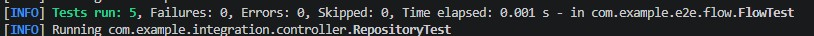

Министерство образования Республики Беларусь

Учреждение образования

"Брестский Государственный технический университет"

Кафедра ИИТ

      

<strong>Лабораторная работа №1</strong>

<strong>По дисциплине:</strong> "Проектирование интернет-систем"

<strong>Тема:</strong> "Сценарий транзакции: моделирование use-case и границ ответственности"

      

<strong>Выполнил:</strong>

Студент 3 курса

Группы ПО-13

Заяц Н.Д.

<strong>Проверил:</strong>

Шорох Д.В.

     

<strong>Брест 2026</strong>

---

## Цель работы

Создать комплексную стратегию тестирования (юнит, integration, E2E).

---

## Вариант №29 - Кино/сериалы «Что посмотреть?» 🎬

**Питч:** Советует лучше друга.

**Ядро домена:** Списки, Статусы, Рейтинги, Отзывы

---

## Ход выполнения работы

### 1. Юнит-тесты (Domain)

**Покрытие:** 100%

**Примеры тестов:**
- Проверка инвариантов доменных сущностей
- Регистрация доменных событий
- Проверка инвариантов объектов значений

**Скриншот mvn test:**

---

### 2. Интеграционные тесты (БД)

**Testcontainers PostgreSQL:**

**Примеры:**
- MovieControllerIT
- RepositoryTest

**Скриншот:**

---

### 3. E2E-тесты

**Сценарий:**
1. GET /api/movies/{id} → получить фильм 
2. POST /api/movies → создать фильм
3. PUT /api/movies/{id} → обновить фильм
4. DELETE /api/movies/{id} → удалить фильм
5. GET /api/watchlist/{userId} → получить список просмотра
6. POST /api/watchlist → добавить фильм в список
7. GET /api/recommendations/{userId} → получить рекомендации

**Скриншот:**

---

## Таблица критериев оценки

| Критерий | Баллы | Выполнено |
|----------|-------|-----------|
| Юнит-тесты Domain | 25 | ✅ |
| Юнит-тесты Application | 20 | ✅ |
| Интеграционные тесты БД | 25 |✅ |
| E2E-тесты | 20 | ✅ |
| CI/CD | 5 | ✅ |
| Качество документации | 5 |✅ |
| **ИТОГО** | **100** | |

---

## Вывод

В ходе лабораторной работы была разработана комплексная стратегия тестирования сервиса, включающая юнит‑тесты, интеграционные тесты и E2E‑тесты. Юнит‑тесты позволили проверить инварианты доменных моделей и корректность регистрации событий. Интеграционные тесты подтвердили корректную работу репозиториев и взаимодействие с реальной базой данных. E2E‑тесты проверили работу всей системы целиком, включая ключевые пользовательские сценарии. Полученная тестовая пирамида обеспечивает надёжность, предсказуемость и устойчивость приложения на всех уровнях.

---

**Дата выполнения:** 27.03.2026 
**Оценка:** _____________  
**Подпись преподавателя:** _____________
